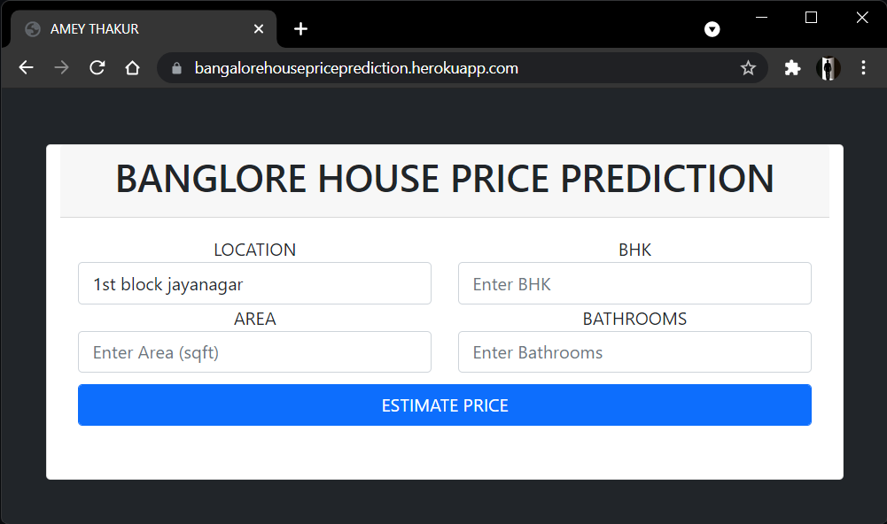

<div align="center">

  <a name="readme-top"></a>
  <h1 align="center">
    <a href="https://www.python.org">
      
    </a><br>
    Python Crash Course
  </h1>

  [](LICENSE)
  
  [](https://github.com/Amey-Thakur/PYTHON-CRASH-COURSE)
  [](https://github.com/Amey-Thakur/PYTHON-CRASH-COURSE)

  **[View Interactive Portfolio](https://Amey-Thakur.github.io/PYTHON-CRASH-COURSE/)**

  IIT Ropar (Diginique Techlabs): Python Crash Course in Data Science, Machine Learning, and Artificial Intelligence. This repository documents a structured curriculum from basic syntax to advanced deep learning and certification.

  **[Curriculum](#features)** &nbsp;·&nbsp; **[Amey's Kaggle](https://www.kaggle.com/ameythakur20)** &nbsp;·&nbsp; **[Mega's Kaggle](https://www.kaggle.com/megasatish)** &nbsp;·&nbsp; **[Certifications](#results)**

</div>

---

<div align="center">

  [Authors](#authors) &nbsp;·&nbsp; [Overview](#overview) &nbsp;·&nbsp; [Activity](#activity) &nbsp;·&nbsp; [Curriculum](#features) &nbsp;·&nbsp; [Structure](#project-structure) &nbsp;·&nbsp; [Project](#projects) &nbsp;·&nbsp; [Certifications](#results) &nbsp;·&nbsp; [Quick Start](#quick-start) &nbsp;·&nbsp; [Usage Guidelines](#usage-guidelines) &nbsp;·&nbsp; [License](#license) &nbsp;·&nbsp; [About](#about-this-repository) &nbsp;·&nbsp; [Acknowledgments](#acknowledgments)

</div>

---

<!-- AUTHORS -->
<div align="center">

  <a name="authors"></a>
  ## Authors

| <a href="https://github.com/Amey-Thakur"></a><br>[**Amey Thakur**](https://github.com/Amey-Thakur)<br><br>[](https://orcid.org/0000-0001-5644-1575) | <a href="https://github.com/msatmod"></a><br>[**Mega Satish**](https://github.com/msatmod)<br><br>[](https://orcid.org/0000-0002-1844-9557) |
| :---: | :---: |

</div>

> [!IMPORTANT]
> ### 🤝🏻 Special Acknowledgement
> *Special thanks to **[Mega Satish](https://github.com/msatmod)** for her meaningful contributions, guidance, and support that helped shape this work.*

---

<!-- OVERVIEW -->
<a name="overview"></a>
## Overview

**Python Crash Course** features the **IIT Ropar (Diginique Techlabs): Python Crash Course in Data Science, Machine Learning, and Artificial Intelligence**. Curated by [**Amey Thakur**](https://github.com/Amey-Thakur) and [**Mega Satish**](https://github.com/msatmod), this project documents a disciplined 12-day curriculum. We successfully navigated the course material, from foundational logic to advanced machine learning models, earning recognized certifications as a testament to this scholarly effort.

The project demonstrates a disciplined approach to upskilling in Data Science, leveraging the **Python Ecosystem** (Pandas, Numpy, Scikit-Learn, TensorFlow) to solve real-world analytical problems.

### Learning Objectives
The curriculum is governed by strict **computational data science principles**:
*   **Statistical Fluency**: Mastering Python's core statistical engine for regression, clustering, and deep learning.
*   **Data Wrangling**: Utilizing `pandas` and vectorization for efficient data manipulation and cleaning.
*   **Machine Learning**: Implementing robust models to predict outcomes and classify data patterns.

> [!TIP]
> **Crash Course Completion**
>
> This repository represents the successful completion of a rigorous **12-Day Crash Course**. Course successfully completed with [**Mega Satish**](https://github.com/msatmod). Each directory corresponds to specific daily milestones, ensuring a linear and verifiable progression of skills.

---

<a name="activity"></a>
## Activity & Commitment

<div align="center">

### 🗓️ 12-Day Coding Streak
`✅ ✅ ✅ ✅ ✅ ✅`  
`✅ ✅ ✅ ✅ ✅ ✅`  
**Continuity: 100% (12/12 Days)**

<br>

| Metric | Diagnostic Value |
| :--- | :--- |
| **Total Scholarly Effort** | ~80+ Dedicated Hours |
| **Average Daily Output** | 6.0+ Hours / Day |
| **Knowledge Transfer** | 100% (Mentor: [Mega Satish](https://github.com/msatmod)) |
| **Status** | **[COMPLETED]** |

<br>

### 📈 Skill Evolution
**Day 1 (Novice Syntax):** `[▬▬-------------]`  
**Day 12 (Advanced AI Core):** `[▬▬▬▬▬▬▬▬▬▬▬▬▬▬▬]`

</div>

---

<!-- FEATURES -->
<a name="features"></a>
## Curriculum

### Python Foundations & Data Structures
- [x] **Day 1** - Variables, Data Types &nbsp;&nbsp; [](https://www.kaggle.com/code/ameythakur20/python-crash-course-day-1) &nbsp;&nbsp; [](https://colab.research.google.com/github/Amey-Thakur/PYTHON-CRASH-COURSE/blob/main/Notebooks/PYTHON_CRASH_COURSE_DAY_1.ipynb)
- [x] **Day 2** - Containers, Dictionary, Manipulation &nbsp;&nbsp; [](https://www.kaggle.com/code/ameythakur20/python-crash-course-day-2) &nbsp;&nbsp; [](https://colab.research.google.com/github/Amey-Thakur/PYTHON-CRASH-COURSE/blob/main/Notebooks/PYTHON_CRASH_COURSE_DAY_2.ipynb)
- [x] **Day 3** - Keywords, Operators, Control Flow, Loops &nbsp;&nbsp; [](https://www.kaggle.com/code/ameythakur20/python-crash-course-day-3) &nbsp;&nbsp; [](https://colab.research.google.com/github/Amey-Thakur/PYTHON-CRASH-COURSE/blob/main/Notebooks/PYTHON_CRASH_COURSE_DAY_3.ipynb)
- [x] **Day 4** - Functions, OOP, Inheritance &nbsp;&nbsp; [](https://www.kaggle.com/code/ameythakur20/python-crash-course-day-4) &nbsp;&nbsp; [](https://colab.research.google.com/github/Amey-Thakur/PYTHON-CRASH-COURSE/blob/main/Notebooks/PYTHON_CRASH_COURSE_DAY_4.ipynb)
- [x] **Day 5** - Exceptions, Numpy, Array, Sampling &nbsp;&nbsp; [](https://www.kaggle.com/code/ameythakur20/python-crash-course-day-5) &nbsp;&nbsp; [](https://colab.research.google.com/github/Amey-Thakur/PYTHON-CRASH-COURSE/blob/main/Notebooks/PYTHON_CRASH_COURSE_DAY_5.ipynb)
- [x] **Day 6** - Pandas, Data Structures &nbsp;&nbsp; [](https://www.kaggle.com/code/ameythakur20/python-crash-course-day-6) &nbsp;&nbsp; [](https://colab.research.google.com/github/Amey-Thakur/PYTHON-CRASH-COURSE/blob/main/Notebooks/PYTHON_CRASH_COURSE_DAY_6.ipynb)

### Machine Learning & Projects
- [x] **Day 7** - Movie Recommender System &nbsp;&nbsp; [](https://www.kaggle.com/code/ameythakur20/python-crash-course-day-7) &nbsp;&nbsp; [](https://colab.research.google.com/github/Amey-Thakur/PYTHON-CRASH-COURSE/blob/main/Notebooks/PYTHON_CRASH_COURSE_DAY_7.ipynb)
- [x] **Day 8** - Linear Regression &nbsp;&nbsp; [](https://www.kaggle.com/code/ameythakur20/python-crash-course-day-8) &nbsp;&nbsp; [](https://colab.research.google.com/github/Amey-Thakur/PYTHON-CRASH-COURSE/blob/main/Notebooks/PYTHON_CRASH_COURSE_DAY_8.ipynb)
- [x] **Day 9** - Logistic Regression, Decision Tree &nbsp;&nbsp; [](https://www.kaggle.com/code/ameythakur20/python-crash-course-day-9) &nbsp;&nbsp; [](https://colab.research.google.com/github/Amey-Thakur/PYTHON-CRASH-COURSE/blob/main/Notebooks/PYTHON_CRASH_COURSE_DAY_9.ipynb)
- [x] **Day 10** - Random Forest, SVM &nbsp;&nbsp; [](https://www.kaggle.com/code/ameythakur20/python-crash-course-day-10) &nbsp;&nbsp; [](https://colab.research.google.com/github/Amey-Thakur/PYTHON-CRASH-COURSE/blob/main/Notebooks/PYTHON_CRASH_COURSE_DAY_10.ipynb)
- [x] **Day 11** - Naive Bayes, KMeans Clustering &nbsp;&nbsp; [](https://www.kaggle.com/code/ameythakur20/python-crash-course-day-11) &nbsp;&nbsp; [](https://colab.research.google.com/github/Amey-Thakur/PYTHON-CRASH-COURSE/blob/main/Notebooks/PYTHON_CRASH_COURSE_DAY_11.ipynb)
- [x] **Day 12** - Stock Price Prediction (RNN) &nbsp;&nbsp; [](https://www.kaggle.com/code/ameythakur20/python-crash-course-day-12) &nbsp;&nbsp; [](https://colab.research.google.com/github/Amey-Thakur/PYTHON-CRASH-COURSE/blob/main/Notebooks/PYTHON_CRASH_COURSE_DAY_12.ipynb)

> [!NOTE]
> ### Detailed Daily Logs
> Detailed code and notebooks for every single day are available in the repository structure. Refer to the directory tree below to navigate to specific topics.

---

<!-- STRUCTURE -->
<a name="project-structure"></a>
## Project Structure

```python
PYTHON-CRASH-COURSE/
│
├── screenshots/                     # Project UI Visuals
│   ├── home_page.png                # Landing Interface
│   ├── prediction_input.png         # Input Methodology
│   └── price_result.png             # Output Estimation
│
├── docs/                            # Documentation Layer
│   └── SPECIFICATION.md             # Technical Architecture
│
├── Mega/                            # Attribution Assets
│   ├── Filly.jpg                    # Companion (Filly)
│   └── Mega.png                     # Profile Image (Mega Satish)
│
├── Certificates/                    # Course Completion Credentials
│   ├── Internship Completion Letter.png
│   ├── Letter of Recommendation.png
│   ├── Project Completion Letter.png
│   └── Training.png
│
├── Notebooks/                       # Core Learning Modules
│   ├── PYTHON_CRASH_COURSE_DAY_1.ipynb  # Foundations
│   ├── ...
│   └── PYTHON_CRASH_COURSE_DAY_12.ipynb # Deep Learning
│
├── Dataset/                         # Data Assets
│   ├── dataset.csv                  # Real Estate Market Data
│   └── ...                          # Supporting CSV Assets
│
├── Notes/                           # Educational Resources
│   └── ...                          # Reference Materials
│
├── .gitattributes                   # Git LFS/Attribute Configuration
├── .gitignore                       # Project Ignore Patterns
├── CITATION.cff                     # Project Citation Manifest
├── codemeta.json                    # Metadata Standard
├── LICENSE                          # MIT License
├── README.md                        # Project Entrance
└── SECURITY.md                      # Security Protocols
```

---

<a name="projects"></a>
## Featured Project

<div align="center">
  <h3>🏠 <a href="https://github.com/Amey-Thakur/BANGALORE-HOUSE-PRICE-PREDICTION">Bangalore House Price Prediction</a></h3>
  <a href="https://github.com/Amey-Thakur/BANGALORE-HOUSE-PRICE-PREDICTION"></a> &nbsp;
  <a href="https://huggingface.co/spaces/ameythakur/Bangalore-House-Price-Prediction"></a> &nbsp;
  <a href="https://youtu.be/HaiXYHBPHVg"></a> &nbsp;
  <a href="https://www.irjet.net/archives/V8/i9/IRJET-V8I934.pdf"></a> &nbsp;
  <a href="https://vixra.org/abs/2110.0026"></a>
  <br><br>
  <i>A machine learning study demonstrating the application of Multivariate Regression algorithms to estimate real estate prices with high precision based on structural parameters.</i>
</div>

> [!WARNING]
> **Legacy Hosting Notice**: This application was originally hosted on **Heroku** (`https://bangalorehousepriceprediction.herokuapp.com`). However, due to the discontinuation of their free tier and maintenance support, the live instance has been successfully migrated to **Hugging Face Spaces** for continued availability.

<div align="center">
  <br>
  <a href="https://youtu.be/HaiXYHBPHVg">
    
  </a>
</div>

### Overview
**Bangalore House Price Prediction** is a machine learning study conducted as part of the **Summer Internship** at **IIT ROPAR - Diginique Techlabs**. The project focuses on the development of a robust regression model capable of predicting property prices in Bangalore with high accuracy.

By leveraging **Scikit-learn**, the system models the real estate landscape where an algorithm learns the relationship between independent variables (Location, Sqft, BHK) and the dependent variable (Price). The model is served via a **Flask** web server for real-time estimation.


> [!NOTE]
> ### Research Impact & Certification
> This project was published as a research paper in the **International Research Journal of Engineering and Technology (IRJET)** (Volume 8, Issue 9) and is also available as a preprint on **viXra**. The project received an official **Publication Certificate** for its research contribution to machine learning education.
>
> *   [Preprint @viXra](https://vixra.org/abs/2110.0026)
> *   [Published Paper @IRJET](https://www.irjet.net/archives/V8/i9/IRJET-V8I934.pdf)
> *   [Publication Certificate](https://github.com/Amey-Thakur/BANGALORE-HOUSE-PRICE-PREDICTION/blob/main/Research%20Paper/IRJET%20-%20Bangalore%20House%20Price%20Prediction.jpg)

### Resources
| # | Resource | Description | Date |
| :---: | :--- | :--- | :--- |
| 1 | [**Source Code**](https://github.com/Amey-Thakur/BANGALORE-HOUSE-PRICE-PREDICTION/tree/main/Source%20Code) | Complete production repository and weights | — |
| 2 | [**Kaggle Notebook**](https://www.kaggle.com/code/ameythakur20/bangalore-house-price-prediction-model) | Interactive Jupyter notebook for model training | — |
| 3 | [**Dataset**](https://www.kaggle.com/datasets/ameythakur20/bangalore-house-prices/) | Curated Bangalore real estate market dataset | — |
| 4 | [**Technical Specification**](https://github.com/Amey-Thakur/BANGALORE-HOUSE-PRICE-PREDICTION/blob/main/docs/SPECIFICATION.md) | System architecture and specifications | — |
| 5 | [**Technical Report**](https://github.com/Amey-Thakur/BANGALORE-HOUSE-PRICE-PREDICTION/blob/main/BHPP/AMEY%20THAKUR%20-%20BANGALORE%20HOUSE%20PRICE%20PREDICTION.pdf) | Comprehensive archival project documentation | September 2021 |
| 6 | [**Publication Certificate**](https://github.com/Amey-Thakur/BANGALORE-HOUSE-PRICE-PREDICTION/blob/main/Research%20Paper/IRJET%20-%20Bangalore%20House%20Price%20Prediction.jpg) | Recognition for research excellence | September 2021 |

> [!TIP]
> ### Model Retraining & Market Adaptation
> To maintain prediction accuracy amidst fluctuating real estate markets, it is recommended to periodically retrain the model with updated property datasets. The provided `model_training.py` pipeline supports incremental updates, ensuring the regression coefficients reflect current economic trends and property valuations.

### Technical Stack & Features
| Component | Technical Description |
|-----------|-----------------------|
| **Data Cleaning** | Automated pipeline for handling missing values and removing logical inconsistencies. |
| **Feature Engineering** | Transformation of categorical features using One-Hot Encoding and reduction of rare labels. |
| **Regression Logic** | Implementation of **Linear/Lasso/Ridge** algorithms for price approximation. |
| **Model Persistence** | Serialization of the trained model using **Pickle** for deployment. |
| **Web Interface** | User-friendly UI built with **HTML/CSS/JS** and served via **Flask**. |

> [!IMPORTANT]
> ### 🏠 Property Valuation Intelligence
> This project represents the practical application of the **Python Crash Course** curriculum. It features an end-to-end Machine Learning pipeline, from outlier detection and dimensionality reduction to model serving via Flask.

### Result

<div align="center">
  <h4>1. User Interface: Home Page</h4>
  <i>Clean and intuitive web interface for property parameters.</i>
  <br><br>
  
  <br><br><br>

  <h4>2. Prediction Input: Feature Selection</h4>
  <i>User selection of Location, SQFT, BHK, and Bathrooms.</i>
  <br><br>
  
  <br><br><br>

  <h4>3. Estimation Result: Price Prediction</h4>
  <i>Real-time price estimation based on the trained regression model.</i>
  <br><br>
  
</div>


---

<a name="results"></a>
## Certifications

<div align="center">
  <b>Data Science Machine Learning and AI using Python</b>
  <br>
  <i>Certified completion of advanced Python programming and AI concepts at IIT Ropar (Diginique Techlabs).</i>
  <br><br>
  <a href="Certificates/Training.pdf">
    
  </a>
  <br><br>
  <a href="Certificates/Project%20Completion%20Letter.pdf">
    
  </a>
  &nbsp;
  <a href="Certificates/Internship%20Completion%20Letter.pdf">
    
  </a>
  <br><br>
  <a href="Certificates/Letter%20of%20Recommendation.pdf">
    
  </a>
  <br><br>
</div>

---

<!-- QUICK START -->
<a name="quick-start"></a>
## Quick Start

### 1. Prerequisites
- **Python (3.7+)**: Core runtime environment. [Download Python](https://www.python.org/)
- **Jupyter Notebook**: Interactive computing environment. [Install Jupyter](https://jupyter.org/install)

> [!WARNING]
> **Runtime Environment Guard**
>
> Python notebooks rely on relative file paths for datasets. Ensure you set your working directory to the **repository root** or the specific notebook folder before execution to prevent `FileNotFoundError` during data loading phases.

### 2. Installation & Setup

#### Step 1: Clone the Repository
Open your terminal and clone the repository:
```bash
git clone https://github.com/Amey-Thakur/PYTHON-CRASH-COURSE.git
cd PYTHON-CRASH-COURSE
```

#### Step 2: Library Synchronization
Ensure all required Python libraries are installed. Open your terminal and run:
```bash
pip install pandas numpy matplotlib seaborn scikit-learn tensorflow
```

### 3. Execution
Navigate to the `Notebooks` directory and launch Jupyter:
```bash
jupyter notebook
```

---

<!-- USAGE GUIDELINES -->
<a name="usage-guidelines"></a>
## Usage Guidelines

This repository is openly shared to support learning and knowledge exchange across the data science community.

**For Students**  
Utilize this repository as a definitive roadmap for mastering semantic Python programming. The 12-day structured progression offers a rigorous, measurable pathway to transition from novice syntax to advanced AI competence.

**For Educators**  
Adopt this curriculum architecture as a modular template for designing intensive coding bootcamps or accelerated data science workshops, providing a proven pedagogical framework for technical capability building.

**For Researchers**  
Reference these artifacts as a verifiable case study in self-paced technical education, demonstrating the efficacy of structured daily challenges in rapid skill acquisition and applied machine learning.

---

<!-- LICENSE -->
<a name="license"></a>
## License

This repository and all its creative and technical assets are made available under the **MIT License**. See the [LICENSE](LICENSE) file for complete terms.

> [!NOTE]
> **Summary**: You are free to share and adapt this content for any purpose, even commercially, as long as you provide appropriate attribution to the original authors.

Copyright © 2021 Amey Thakur & Mega Satish

---

<!-- ABOUT -->
<a name="about-this-repository"></a>
## About This Repository

**Created & Maintained by**: [Amey Thakur](https://github.com/Amey-Thakur) & [Mega Satish](https://github.com/msatmod)

**Python Crash Course** serves as a comprehensive technical archive for a structured 12-day curriculum focused on **Data Science**, **Machine Learning**, and **Artificial Intelligence**. This repository bridges foundational computer engineering principles with applied analytics, documenting the complete technical lifecycle from exploratory data analysis and algorithmic modeling to real-world product deployment. It provides a verifiable and reproducible roadmap for mastering the modern Python ecosystem through disciplined, daily milestones.

**Connect:** [GitHub](https://github.com/Amey-Thakur) &nbsp;·&nbsp; [LinkedIn](https://www.linkedin.com/in/amey-thakur) &nbsp;·&nbsp; [ORCID](https://orcid.org/0000-0001-5644-1575)

### Acknowledgments

Grateful acknowledgment to [**Mega Satish**](https://github.com/msatmod) for her exceptional collaboration and scholarly partnership during this Python Crash Course. Her intellectual agility, a veritable superpower to rapidly synthesize complex logic and articulate it with clarity, was the driving force behind the successful mastery of this intensive curriculum. She navigated advanced Python and AI concepts with remarkable speed, clarifying intricate details in a way that made the learning process reciprocal and effortless. Her engagement was essential for the completion of these daily milestones; this educational journey would not have been possible without her steady discipline, ability to simplify the complex, and constant encouragement. Thank you, Mega, for everything you shared and taught along the way.

Special thanks to the **mentors and peers** whose encouragement, discussions, and support contributed meaningfully to this learning experience.

---

<div align="center">

  [↑ Back to Top](#readme-top)

  [Authors](#authors) &nbsp;·&nbsp; [Overview](#overview) &nbsp;·&nbsp; [Activity](#activity) &nbsp;·&nbsp; [Curriculum](#features) &nbsp;·&nbsp; [Structure](#project-structure) &nbsp;·&nbsp; [Project](#projects) &nbsp;·&nbsp; [Certifications](#results) &nbsp;·&nbsp; [Quick Start](#quick-start) &nbsp;·&nbsp; [Usage Guidelines](#usage-guidelines) &nbsp;·&nbsp; [License](#license) &nbsp;·&nbsp; [About](#about-this-repository) &nbsp;·&nbsp; [Acknowledgments](#acknowledgments)

  <br>

  🏆 **[Python Crash Course](https://github.com/Amey-Thakur/PYTHON-CRASH-COURSE)**

  ---

  ### 🎓 [Computer Engineering Repository](https://github.com/Amey-Thakur/COMPUTER-ENGINEERING)

  **Computer Engineering (B.E.) - University of Mumbai**

  *Semester-wise curriculum, laboratories, projects, and academic notes.*

</div>
