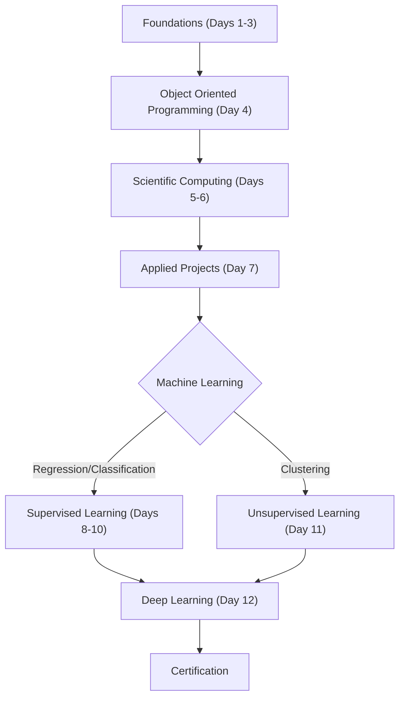

# Technical Specification: Python Crash Course

## Architectural Overview

**Python Crash Course** is a structured, linear progression architecture designed to systematically build data science and machine learning competency through a rigorous 12-day curriculum. The project serves as a comprehensive study into the **Python Ecosystem**, bridging the gap from foundational syntax to advanced machine learning algorithms and deep learning concepts.

### Learning Logic Flow

---

## Technical Implementations

### 1. Core Computational Engine
-   **Runtime Environment**: Built on **Python 3.x**, utilizing the **SciPy** stack for scientific computation and **Standard Library** for core application logic.
-   **Object-Oriented Design**: Emphasizes Python's class-based structure, inheritance, and polymorphism to ensure modular and reusable code architecture.

### 2. Modules & Libraries
-   **Data Wrangling**: Implements **`pandas`** and **`numpy`** for high-performance data manipulation, array processing, and numerical analysis.
-   **Visual Synthesis**: Utilizes **`matplotlib`** and **`seaborn`** to construct insightful, publication-quality visualizations for exploratory data analysis (EDA).
-   **Machine Learning**: Deploys **`scikit-learn`** for designing robust predictive models and **`keras`/`tensorflow`** concepts for deep learning implementations.

### 3. Statistical Framework
-   **Analysis Pipelines**: The repository structures formal machine learning workflows including **Linear/Logistic Regression**, **Random Forests**, **Support Vector Machines**, and **K-Means Clustering**.
-   **Deep Learning**: Integrates Recurrent Neural Networks (RNN) for advanced sequence modeling and time-series prediction (Stock Price Prediction).

---

## Technical Prerequisites

-   **Runtime**: Python 3.7 or higher ([Python.org](https://www.python.org/)).
-   **Development**: Jupyter Notebook, Google Colab, or Anaconda Distribution.
-   **Dependencies**: Valid `pip install` synchronization for pandas, numpy, sklearn, and matplotlib suites.

---

*Technical Specification | Python Crash Course | Version 1.0*
